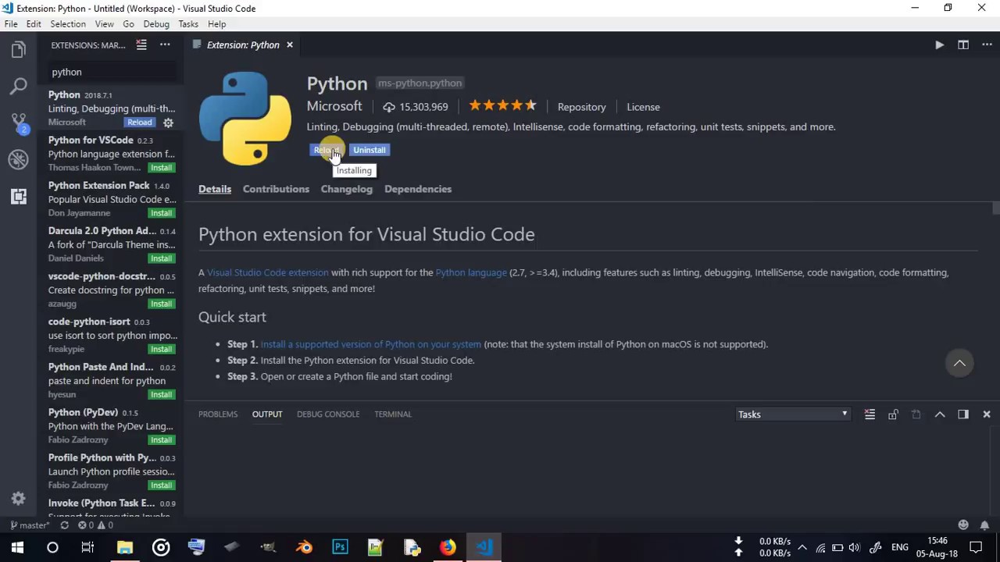

# Workshop prep

## python

1. Interpreter języka python
2. Visual Studio Code
3. Moduł obsługi języka python do Visual Studio Code
4. Moduł virtualenv

### Zainstaluj interpreter pythona 3.7 lub 3.6 (Windows)

https://www.python.org/downloads/

**Koniecznie** odhacz wskazaną opcję

### Zainstaluj edytor
  * https://code.visualstudio.com/download

### Zainstaluj dodatek do VS Code obsługujący pythona
  1. Uruchom Visual Studio Code
  2. Przejdź na zakładkę **Extensions** (ostatnia ikona po lewej)
  3. Wyszukaj `python` i kliknij **Install**
  
Szczegóły znajdziesz pod adresem: https://marketplace.visualstudio.com/items?itemName=ms-python.python

### Dodatkowe rozszerzenia do Visual Studio Code
* [indent rainbow](https://marketplace.visualstudio.com/items?itemName=oderwat.indent-rainbow)
* [Rainbow CSV](https://marketplace.visualstudio.com/items?itemName=mechatroner.rainbow-csv)
* [local history](https://marketplace.visualstudio.com/items?itemName=xyz.local-history)
* warto zainstalować wieloschowek, multi clipboard

### Zainstaluj moduł virtualenv
1. W Visual Studio Code wciśnij **Ctrl + `** (klawisz na górze po lewej od jedynki)
2. wpisz `pip3 install virtualenv`

## Dodatkowo
* ściągnij [git](https://git-scm.com/)
* załóż konto na [githubie](https://github.com)

